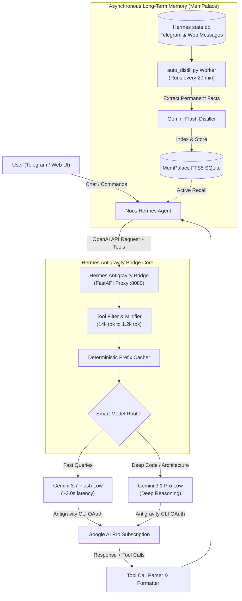

# 🌌 Hermes Antigravity Bridge 🚀

> **"Why pay per token on API keys when you already have a top-tier monthly AI subscription?"**  
> An open-source, ultra-fast OpenAI-compatible translation layer and persistent memory engine that bridges **Nous Research Hermes Agent** (and other autonomous agents) with **Google Antigravity CLI / Gemini Pro & Flash** using your flat-rate subscription.

⚡ **Developed 100% with pure #VibeCoding** in pair programming by **Florin** and **Antigravity AI**! 🎧💻✨

---

## 🌟 What Is This?

Autonomous AI agents (like **Hermes Agent**, AutoGen, OpenDevin, Roo Code) are incredible, but they are token gluttons: a single multi-turn reasoning loop with 40+ tool definitions can easily chew through $10–$30/day in pay-per-token API fees.

Meanwhile, subscriptions like Google AI Pro / Antigravity provide massive quotas of **Gemini 3.1 Pro** and **Gemini 3.7 Flash** for a flat monthly fee.

**Hermes Antigravity Bridge** is a purpose-built translation middleware that:
1. 🔌 **Mocks an OpenAI `/v1/chat/completions` API** on your local network.
2. 🛠️ **Translates Full Tool Calling (Function Calling)** between OpenAI JSON schemas and Antigravity/Gemini execution.
3. 📉 **Minifies Tool Schemas & Chat History**, dropping input tokens from 14,000 to under 1,200 tokens per turn (saving ~90% of token bandwidth!).
4. ⚡ **Triggers Deterministic Google Prefix Prompt Caching** for sub-2-second responses.
5. 🧠 **Includes MemPalace + Background Auto-Distillation**: An asynchronous worker polls your chat history across Telegram and Web UI, auto-extracts permanent facts/fixes, and indexes them into an FTS5 SQLite memory palace with **zero live chat latency**.

---

## 🏗️ Architecture Overview



---

## ✨ Key Features

- **🚀 Sub-2-Second Responses**: Optimized for live Telegram & Web chat without painful 20-second wait times.
- **🛠️ Bidirectional Function Calling**: Full tool support (`terminal`, `file_ops`, `memory`, custom scripts).
- **📉 Extreme Token Optimization**:
  - Drops third-party cloud tool schemas (Feishu, WeChat, Apple, etc.) leaving only active local homelab tools.
  - Implements sliding window on message history.
  - Automatically truncates stale megabyte-long terminal command outputs.
- **🌐 Cross-Platform Sync**: Telegram bot and Web UI communicate seamlessly via shared state and `mempalace_helper.py recent`.
- **🧠 Background Episodic Memory**: No live chat pauses for memory saving. Facts, device IPs, credentials, and bug fixes are distilled in the background every 20 minutes.
- **🎛️ Smart Model Routing**: Automatic escalation to Gemini 3.1 Pro for heavy code/architecture tasks, Gemini 3.7 Flash for everything else.

---

## 🚀 Quick Start

### 1. Requirements
- Linux / macOS server with Python 3.10+
- Google Antigravity CLI (`agy`) installed and logged in with your subscription:
  ```bash
  agy --version
  ```
- Nous Research Hermes Agent (or any agent expecting OpenAI endpoint).

### 2. Installation
```bash
git clone https://github.com/yourusername/hermes-antigravity-bridge.git
cd hermes-antigravity-bridge

python3 -m venv .venv
source .venv/bin/activate
pip install -r requirements.txt
```

### 3. Run the Proxy
```bash
python3 hermes_proxy.py
```
The server will start listening on `http://0.0.0.0:8080`.

### 4. Configure Hermes Agent
In your Hermes `config.yaml`:
```yaml
model:
  provider: custom
  default: taticu-magic

credentials:
  custom:
    base_url: http://127.0.0.1:8080/v1
    api_key: moca
```

### 5. Setup Background Memory Distillation (Optional but Recommended)
Add a cron job to automatically distill new chat facts into MemPalace every 20 minutes:
```bash
crontab -e
# Add:
*/20 * * * * /path/to/hermes-antigravity-bridge/auto_distill.py >> /var/log/auto_distill.log 2>&1
```

---

## 📂 Project Structure

```
hermes-antigravity-bridge/
├── hermes_proxy.py         # Main FastAPI translation bridge with tool parsing & token saver
├── auto_distill.py         # Background worker for asynchronous episodic memory distillation
├── mempalace_helper.py     # SQLite FTS5 long-term memory engine & cross-channel sync tool
├── systemd/
│   └── hermes-proxy.service # Systemd service definition for 24/7 background operation
├── requirements.txt        # Minimal Python dependencies (FastAPI, uvicorn)
├── LICENSE                 # MIT License
└── README.md               # Documentation & VibeCoding manifesto
```

---

## ⚖️ Disclaimer

This project is an open-source educational research tool demonstrating protocol translation, context minification, and background memory distillation for personal developer workflows. Users are responsible for ensuring compliance with the Terms of Service of their respective AI providers.

---

## 💖 Credits & VibeCoding Story

Built with ❤️ and **100% VibeCoding** by **Florin** and **Antigravity AI**.  
*No tedious boilerplate, no corporate fluff — just pure architectural vibes, high-speed engineering, and clever homelab hacks.* 🕶️⚡
